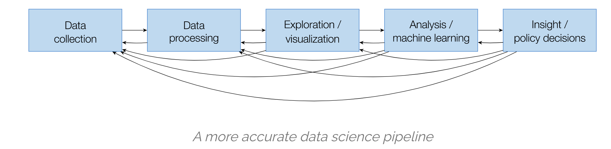

## Introduction: 

Data Science has been around for a while. Even big data has been around for a while(Hubble has been sending us image data and Scientists at 
CERN have been collecting Tera Bytes to uncover the secrets of the universe). Business recently realised that can extract value out of the 
data they collect(e.g user data and event data) to make data-informed decisions which replaces the old model of going with the gut instinct, 
loudest voice, and best argument methods. The insights gathered through this process can help improve existing processes and lower operations cost. 
Learning 'how to be smart with data' is also bit of an art, that requires curosity, creativity and attention to detail and so on. 
All of this requires experience and practice.  

Instead of providing a sophisticated definition of Data Science, We run with this definition for now(by J. Kolter at CMU): 

> Data science = statistics + data collection + data preprocessing + machine learning + visualization + business insights + scientific hypotheses + big data + (etc)

    - Every data Science Project starts with a question that is to be answered with data. That means forming the question is an important first step in the process. 
    - The second step is finding or generating the data you are going to use to answer that question. 
    - With that question solidified and data in hand, the data are then analysed, first by exploring the data and then often by modeling the data, which means using some statisitcal or machine learning techniques to analyse the data and answer your question
    - After drawing conclusions from this analysis, the project has to be communicated to others.

cheatsheet: https://st2.ning.com/topology/rest/1.0/file/get/1211570060?profile=original 
----------------------------------------------------------------------------------------------------------------

#### Experiment LifeCyle - An Iterative Process: 
Data Science analytics are a lot like broccoli – fractal in nature in
both time and construction. Early versions of an analytic follow the
same development process as later versions. At any given iteration, the
analytic itself is a collection of smaller analytics that often decompose
into yet smaller analytics. This is described as follows: 

Decomposing the problem into manageable pieces is the frist step
in the analytic selection process. Achieving a desired analytic action
often requires combining multiple analytic techniques into a holistic,
end-to-end solution. Engineering the complete solution requires that
the problem be decomposed into progressively smaller sub-problems.
Fractal Analytic Model embodies this approach. At any given
stage, the analytic itself is a collection of smaller computations that
decompose into yet smaller computations. When the problem is
decomposed far enough, only a single analytic technique is needed
to achieve the analytic goal. Problem decomposition creates multiple
sub-problems, each with their own goals, data, computations, and
actions.

  Set up the infrastructure, aggregate and prepare the data, and
incorporate domain expert knowledge. Try di$erent analytic
techniques and models on subsets of the data. Evaluate the models,
refine, evaluate again, and select a model. Do something with your
models and results – deploy the models to inform, inspire action, and
act. Evaluate the business results to improve the overall product.

For Machine Lerning Projects: 

#### references: 
  - Data Science Field guide - Booz Allen Hamilton
  - https://dfrieds.com/articles/recipe-great-data-science-work.html
  - https://towardsdatascience.com/task-cheatsheet-for-almost-every-machine-learning-project-d0946861c6d0
  

----------------------------------------------------------------------------------------------------------------
----------------------------------------------------------------------------------------------------------------
## Topics: 

- Data Munging (Data Acquistion and pre-processing) 
- Data Analytics: 
- Prescriptive Analytics 
- Data Engineering (Large Scale Data Processing) 
- Project Management 
----------------------------------------------------------------------------------------------------------------

## Data Analytics: 

we cover the following topics: 

1. Descriptive Analysis:
    The goal of descriptive analysis is to describe or summarize a set of data. 
    
2. Exploratory Analysis 
    The goal of exploratory analysis is to examine or explore the data and find relationships that werent previously known. 

3. Inferential Analysis
    The goal of inferential analysis is to use a relatively small sample of data to infer or say something about population at large. 

4. Predictive Analytics:
    The goal of predictive analysis is to use current data to make predictions about future data. 

5. Causal Analysis 
    The caveat to a lot of the analysis we have looked at above is that we can only see correlations and can’t get at the cause of the 
    relationships we observe. Causal analysis fills that gap. the goal of the causal analysis is to see what happens to one variable when we manipulate anohter variable. looking at the cause and effect of a relationship. 

## Descriptive Analytics 

Descriptive Analytics is aimed at answering real busiessn questions. Describing the dataset at hand, Discovering insigths and Acting on those insights. 
It requires finding meaningful patterns, trends and exceptions that are easy to see and interpret for decision makers. 

> The goal of descriptive analysis is to describe or summarize a set of data. Whenever you get a new dataset to examine, this is usually the first kind of analysis you will perform. Descriptive analysis will generate simple summaries about the samples and their measurements. You may be familiar with common descriptive statistics: measures of central tendency (eg: mean, median, mode) or measures of variability (eg: range, standard deviations or variance).
This type of analysis is aimed at summarizing your sample – not for generalizing the results of the analysis to a larger population or trying to make conclusions. Description of data is separated from making interpretations; generalizations and interpretations require additional statistical steps.
Some examples of purely descriptive analysis can be seen in censuses. Here, the government collects a series of measurements on all of the country’s citizens, which can then be summarized. Here, you are being shown the age distribution in the US, stratified by sex. The goal of this is just to describe the distribution. There is no inferences about what this means or predictions on how the data might trend in the future. It is just to show you a summary of the data collected.

### Data Wrangling

> Data wrangling is about taking a messy or unrefined source of data and turning it into something useful. 
You begin by seeking out raw data sources and determining their value: How good are they as data sets? 
How relevant are they to your goal? Is there a better source? Once you’ve parsed and cleaned the data so that the data sets are usable, 
you can utilize tools and methods (like Python scripts) to help you analyze them and present your findings in a report. 
This allows you to take data no one would bother looking at and make it both clear and actionable.

#### Learning the tools 

| Notebook                 | Description | Code |
|--------------------------|-----------|------|
| Command-line             | Learn various unix command line utlities and how they can be used to clean and compute basic statistics          | [blog_post](https://asjadkhan.ghost.io/ghost/#/site) |     
| Pandas Tutorial          |           |Notebook        |     
| Web Data Collection      | Learn to collect data available on web (APIs or web scrapping)          | [Notebook](https://github.com/asjad99/datascience-GYM/tree/master/data_engineering)          |  
| numpy_Basics     | Learn the basics of the library that underpins scientific computing          |Notebook        | 
| numpy_linear_algebra     |           |Notebook        |     
| Pandas Tutorial          | Learn the basics of pandas using air pollution and temperature data for the city of Chicago          |Notebook        |      |

#### Exploratory Data Analysis: 

The goal of exploratory analysis is to examine or explore the data and find relationships that weren’t previously known. Exploratory analyses explore how different measures might be related to each other but do not confirm that relationship as causitive. You’ve probably heard the phrase “Correlation does not imply causation” and exploratory analyses lie at the root of this saying. Just because you observe a relationship between two variables during exploratory analysis, it does not mean that one necessarily causes the other.

Because of this, exploratory analyses, while useful for discovering new connections, should not be the final say in answering a question! It can allow you to formulate hypotheses and drive the design of future studies and data collection, but exploratory analysis alone should never be used as the final say on why or how data might be related to each other.

Going back to the census example from above, rather than just summarizing the data points within a single variable, 
we can look at how two or more variables might be related to each other. 
In the plot below, we can see the percent of the workforce that is made up of women in various sectors and how that has changed between 2000 and 2016. Exploring this data, we can see quite a few relationships. Looking just at the top row of the data, we can see that women make up a vast majority of nurses and that it has slightly decreased in 16 years. While these are interesting relationships to note, the causes of these relationships is not apparent from this analysis. 
All exploratory analysis can tell us is that a relationship exists, not the cause.

| Notebook                 | Description | Notebook |
|--------------------------|-----------|------|
| Data Exploration         | Data Exploration using data ozone levels dataset          |      |
| Principles of data Exploration       |           |  Blog_post    |
| statsmodels              |           |      |

### Useful Guides:

Data Formats should be easy for computers to parse, people to read and widely used by systems in production. 
The computations we perform must be reproducible and tweakable. Data Pipelines need to be documented. 

- Guide for [Common Data Types and Formats](https://github.com/asjad99/datascience-GYM/blob/master/Data_Munging/2.%20data_types_formats.ipynb)
- Guide by Jeff lean on [how to share data with a statistician](https://github.com/asjad99/datascience-GYM/blob/master/Data_Munging/3.%20Data_Cleaning.ipynb)
- [Reproducability in Data Science](https://maxmasnick.com/media/slides/data-analysis-reproducibility/data-analysis-reproducibility.pdf)

#### Interesting case studies: 

Context, inferences and models are created by humans and carry with them biases and assumptions. Blindly trusting your analyses is a dangerous thing
that can lead to erroneous conclusions. We should try to clearly communite our findings by describing: 

- What problem are we trying to solve and why its intresting? 
- Document your assumptions and make sure they have not introduced bias in your work.
- Does the approach taken and answers make sense? (we should be Be skeptical of surprise findings and make sure the analysis address the
original intent)

The goal of your analysis is to tell an actionable story. Its good to see some data science projects and learn from them. In each project, the author had a question they wanted to answer and used data to answer that question. They explored, visualized, and analysed the data. Then, they wrote blog posts to communicate their findings. Take a look to learn more about the topics listed and to see how others work through the data science project process and communicate their results!

- https://pennmusa.github.io/MUSA_801.io/project_5/index.html
- https://sharlagelfand.netlify.app/posts/tidying-toronto-open-data/
- https://masalmon.eu/2017/11/16/wheretoliveus/
- http://varianceexplained.org/r/trump-tweets/

## Causal analysis

 The caveat to a lot of the analysis we have looked at above is that we can only see correlations and can’t get at the cause of the relationships we observe. Causal analysis fills that gap. the goal of the causal analysis is to see what happens to one variable when we manipulate anohter variable. looking at the cause and effect of a relationship. 

## Inferential analysis

The goal of inferential analysis is to use a relatively small sample of data to infer or say something about population at large. 
----------------------------------------------------------------------------------------------------------------

## Predictive Analytics with Machine Learning 

Machine Learning  Utilizes past observation data to predict future observations. e.g Can we predict which products
that certain customer groups are more likely to purchase? 

It also allows us to implement cool new feature like smart reply in gmail. 

This is summarised by Jeff Bezos in his 2016 letter to Amazon shareholders:

> Over the past decades computers have broadly automated tasks that programmers could describe with clear rules and algorithms. 
Modern machine learning techniques now allow us to do the same for tasks where describing the precise rules is much harder.

In terms of impact most of AI technologies currently being deployed are still falling under this machine learning. 

According to Andrew NG: 

> Almost all of AI’s recent progress is through one type, in which some input data (A) is used to quickly generate some simple response (B). Being able to 
input A and output B will transform many industries. The technical term for building this A→B software is supervised learning. These A→B systems have been
improving rapidly, and the best ones today are built with a technology called deep learning or deep neural networks, which were loosely inspired by the brain. 

According to J. Kolter at CMU:  

> for many data science problems, simple machine learning algorithms suffice to attain sufficiently good performance (by whatever metric you want to define performance, but I simply mean that they effectively solve the problem). The numbers here are all just examples (specifically the solvable/unsolvable ratio), but the point it gets at is important. There are many data science problems one would like to be able to solve, but in a large number of these cases, there is simply no way to solve the problem given the available data. For the set of problems that are solvable with some kind of machine learning, the vast majority will be solvable at least to a level of sufficient performance, using relatively simple models. The 5% of remaining problems is an important one, because they often consist of the most “interesting” problems from a research standpoint (think problems like speech recognition, natural language understanding, computer vision), but they are often not indicative of the types of problems one encounters in “most” data science applications.

Machine Learning Engineer: 

a machine learning engineer is someone who sits at the crossroads of data science and data engineering, and has proficiency in both data engineering and 
data science.

The ultiamte goal of Machine learning is to be able to generatize to new unseen data. i.e predicting
behavior under new conditions. we study Problems like: Regression, Clustering, Classication, Recommendation. 

| Algorithm           | Notebooks | Description |
|---------------------|-----------|-------------|
| Linear Regression   |           |             |
| Logistic Regression |           |             |
| SVMs                |           |             |
| XGboost             |           |             |
| Clustering          |           |             |

#### Cool ML Applications: 

- The Case for Learned Index Structures 
- [Machine Learning in Compilers: Past, Present and Future] (https://research.fb.com/wp-content/uploads/2020/09/Machine-Learning-in-Compilers-Past-Present-and-Future.pdf)
- [Using machine learning for code recommendation](https://ai.facebook.com/blog/aroma-ml-for-code-recommendation/)
- [Learn to rank](https://medium.com/@nikhilbd/intuitive-explanation-of-learning-to-rank-and-ranknet-lambdarank-and-lambdamart-fe1e17fac418
https://arxiv.org/pdf/1812.00073.pdf)
- Deep learning to translate between programming languages https://ai.facebook.com/blog/deep-learning-to-translate-between-programming-languages/

#### Useful Guides: 

- Understanding Generalizations in Machine Learning 
- Why is ML hard http://ai.stanford.edu/~zayd/why-is-machine-learning-hard.html 
- Debugging ML Systems (Machine learning Yearning by Andrew Ng)
- Feature Engineering and dimensionality reduction
- Challenges in Deploying Machine Learning: a Survey of Case Studies
- Challenges in Production: https://blog.acolyer.org/2019/10/07/150-successful-machine-learning-models/

----------------------------------------------------------------------------------------------------------------

## Predictive Analytics with Reinforcement Learning 

We can model many problems as a Markov Decision Process or POMDP. We define a reward function that captures out goals and we then find a policy that maximuses the sum of future rewards.
This is similar to Operations Research techniques focused on selecting the best element from a set of available alternatives to maximize a utility function. 

#### My Notes on RL Theory: 
  - 3 pillers of reinforcement learning 
  - Exploration vs Exploitation 
  - [RL in the Real World: Challenges and Opportunities](https://asjadkhan.ghost.io/real-world-rl/?fbclid=IwAR0jDaeMeALcSnEZu3gVq1MfZQegeXbWuWYt5W3PJNV1NiSePABsoAvS2EY)
  - Counterfactual Policy Evaluation  

#### Project: 
  - [Supporting Knowledge Instensive Processes in Clincial Settings](https://asjadkhan.ghost.io/ghost/#/site) 

#### Resources 
  - [Math of RL](https://www.youtube.com/watch?app=desktop&v=LiaEmNToeQA&list=PLTPQEx-31JXhguCush5J7OGnEORofoCW9&index=17&t=0s)
  - [Deep Reinforcement Learning](https://spinningup.openai.com/en/latest/)

------------------------------------------------------------------------------------------------------------------------

## Data Engineering 

> a data engineer is someone who has specialized their skills in creating software
solutions around big data.

### Data Engineering is concerned with following: 

##### Build and maintain the organization’s data pipeline systems
> Creating a data pipeline may sound easy or trivial, but at big data scale, this means bringing together 10-30 different big data technologies. 
More importantly, a data engineer is the one who understands and chooses the right tools for the job. 
A data engineer is the one who understands the various technologies and frameworks in-depth, and how to combine them to create solutions to enable a 
company’s business processes with data pipelines.

read moreBuilding Data Pipelines with Python — Katharine Jarmul explains how to build data pipelines and automate workflows.

##### Clean and wrangle data into a usable state

> Data engineers make sure the data the organization is using is clean, reliable, and prepped for whatever use cases may present themselves. 
Data engineers wrangle data into a state that can then have queries run against it by data scientists.

### Data Models

| Algorithm           | Notes     | 
|---------------------|-----------|
| Relational Data     |           |
| Document Model      |           |
| Graph Model         |           |

### Primer on distributed systems 

Replication
Partitioning
Transactions 
Consistency and Consensus

### Data Ingestion 
### Large-Scale Processing 

| Notebook                 | Description | Code | Blog | 
|--------------------------|-------------|------|------|
| Speeding up Numpy        | Learn how to get optimal performance out of NumPY | | [Notes](https://asjadkhan.ghost.io/speeding-up-numpy/)          |
| Spark Tutorial           | Learn large scale Data Engineering with Spark          |     | [Notes](https://asjadkhan.ghost.io/ghost/#/editor/post/5f39c86010c8da00398dc9ce)     |
| Topic Modeling in Spark  | LSI Modeling in Spark to Extract document topics | [Python_code](https://gist.github.com/asjad99/e87a695df10b0859ee943b8e661f0fc3)  | |
|

#### Guides: 
- Batch Processing 
- Stream Processing 

#### Data Storage  
storage engines (e.g. S3, HDFS, HBase, Kudu)

### resources:

- Designing Data-Intensive Applications
- https://github.com/andkret/Cookbook
- Is dataFrame just a table
- https://www.mikealche.com/software-development/a-humble-guide-to-database-schema-design
- SQL Mastery
------------------------------------------------------------------------------------------------------------------------
## Math for Data Science
Data science rests on a foundation of mathematics, particularly statistics and linear algebra. It is important to
understand this material on an intuitive level: why these concepts were
developed, how they are useful, and when they work best. e.g develop statistical reasoning is a core goal. 

| Algorithm           | Description | Code |
|---------------------|-----------|-------------|
| Sets   |           |             |
| Graph Theory             |           |             |
| Linear Algebra |           |             |
| Probability                |           |             |
| Statistics                |           |             |

## Project Management 

Data Science is more than feature engineering, training models. XOR build applications and deploy models. Its involves:

> meeting client, understanding business problem, write code to connect to data sources,
get the data, clean it, set up training environments, train models, set up serving environments, 
deploy models, write the application (web, mobile).

Data Science supports and encourages shifting between deductive (hypothesis-based) and inductive (pattern-based) reasoning. Tis is a fundamental change from traditional analytic approaches. Inductive reasoning and exploratory data analysis provide a means to form or refine hypotheses and discover new analytic paths. In fact, to do the discovery of signifcant insights that are the hallmark of Data Science, you must have the tradecraft and the interplay between inductive and deductive reasoning. By actively combining the ability to reason deductively and inductively, Data Science creates an environment where models of reality no longer need to be static and empirically based. Instead, they are constantly tested, updated and improved until better models are found. These concepts are summarized in the figure, The Types of Reason and Their Role in Data Science Tradecraft.

The diferences between Data Science and traditional analytic approaches do not end at seamless shifting between deductive and inductive reasoning. Data Science offers a distinctly different perspective than capabilities such as Business Intelligence. Data Science should not replace Business Intelligence functions within an organization, however. Te two capabilities are additive and complementary, each offering a necessary view of business operations and the operating environment. Te fgure, Business Intelligence and Data Science – A Comparison, highlights the diferences between the two capabilities. Key contrasts include:

### 
Data Science Projects Pipeline:
    Data Collection → Data Processing → Exploration/visualization → analysis/machine learning → insight/policy decisions 

### Data Science Maturity within an Organization: 

We use the Data Science Maturity Model as a common framework for describing the maturity progression and components that make up a Data Science capability. Tis framework can be applied to an organization’s Data Science capability or even to the maturity of a specifc solution, namely a data product. At each stage of maturity, powerful insight can be gained.

### Building Your Data Science Team: 

A critical component to any Data Science capability is having the right team. 
Data Science depends on a diverse set of skills as shown in Te Data Science Venn Diagram. 
Computers provide the environment in which data-driven hypotheses are tested, and as such, computer science is necessary 
for data manipulation and processing. Mathematics provides the theoretical structure in which Data Science problems are examined. 
A rich background in statistics, geometry, linear algebra, and calculus are all important to understand the basis for many algorithms and tools. 
Finally, domain expertise contributes to an understanding of what problems actually need to be solved, 
what kind of data exists in the domain, and how the problem space may be instrumented and measured.

### Referenes and Further Readings: 

- Field Guide to data science https://wolfpaulus.com/wp-content/uploads/2017/05/field-guide-to-data-science.pdf
- Executive Data Science Specialization
- AI Product manager nanodegree 
- [Creating a data driven organization](https://www.oreilly.com/library/view/creating-a-data-driven/9781492049227/ch04.html)

- [Managing Data Science Teams and Projects](https://www.oreilly.com/library/view/managing-data-science/9781838826321/)

--------------------------------------------------------------------
--------------------------------------------------------------------

Acknowledements: 

This Project and notebooks are  inspired by peter norvig's [pytudes project](https://github.com/norvig/pytudes#pytudes-index-of-jupyter-ipython-notebooks),
 Project's by folks like: [Donne_Martin](https://github.com/donnemartin/data-science-ipython-notebooks), [Dfriends](https://dfrieds.com/), [Chris_albon](https://chrisalbon.com/).  
and many others 