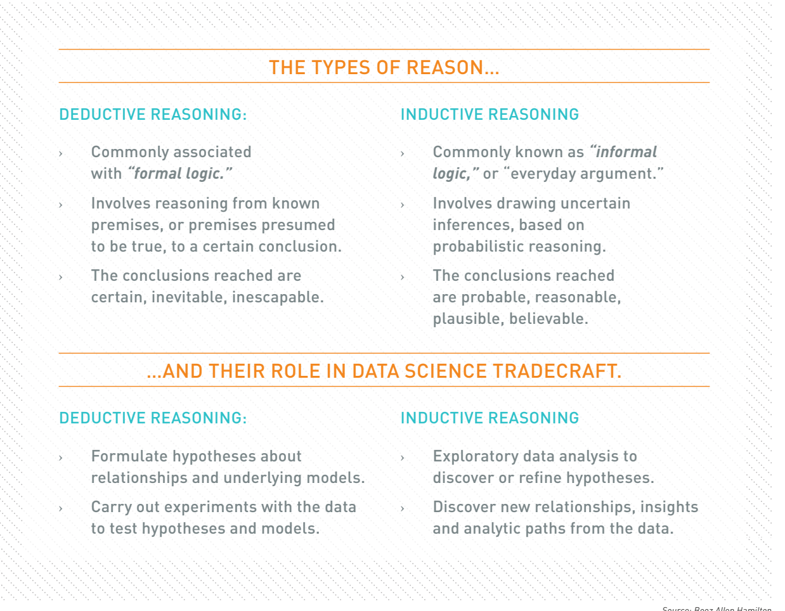
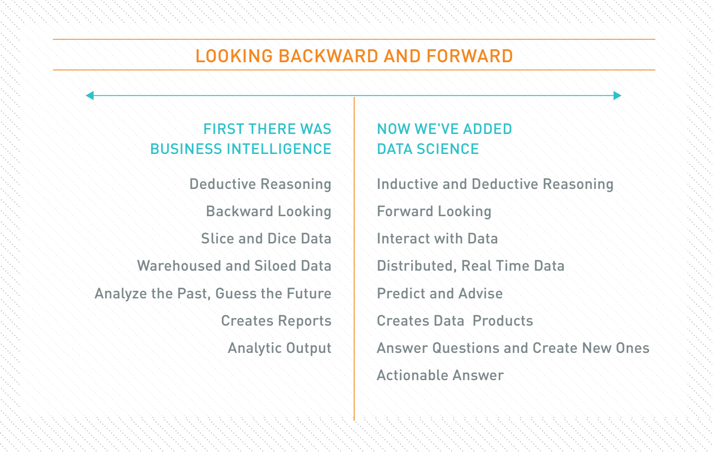
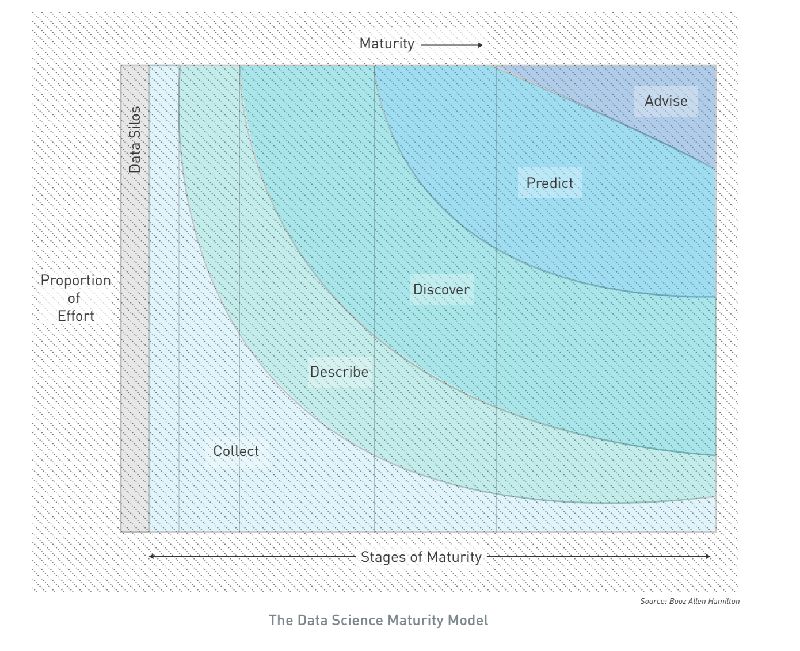

### About: 
- This Project and notebooks are currently 'work in progress'. 

- It's inspired by [Open Source Society University](https://github.com/ossu/data-science), peter norvig's [pytudes project](https://github.com/norvig/pytudes#pytudes-index-of-jupyter-ipython-notebooks),
multiple Project's by folks like: [Donne_Martin](https://github.com/donnemartin/data-science-ipython-notebooks), [Dfriends](https://dfrieds.com/), [Chris_albon](https://chrisalbon.com/) and many others. 

- Roadmap: It provides an opportunity to document some of my own learnings and acts as a [data science road map](https://i.am.ai/roadmap/#fundamentals) for self-taught learners out there to learn data science for free 

- [Computational notebooks](https://www.nature.com/articles/d41586-018-07196-1): Computational notebooks are essentially laboratory notebooks for scientific computing. We use Notebooks for Practice(as they are best suited for scientific computing). This is closely related to litrate programming paradigm(as conceived by Don Knuth) 

- This is a long list. see [this great article](https://towardsdatascience.com/how-to-become-a-data-scientist-2a02ed565336) on how to approach it depending on the [Career paths you decide to take](https://workera.ai/resource_downloads/ai_career_pathways/)

--------------------------------------------------------------------------------------------------------

## Topics: 

- [Introduction to data Science](#introduction-to-Data-Science)
- [Data Science Experiment LifeCyle](#Data-Science-Experiment-LifeCyle)
- [Data Wrangling Tools](#Data-Wrangling-Tools)
- [Exploratory Data Analysis](#Exploratory-Data-Analysis)
- [Data Cleaning](#Data-Cleaning)
- [Data Analytics (Descriptive, Inferential, Predictive, Causal)](#Data-Analytics)
- [Importance of Story telling and Case Studies](#Importance-of-Story-telling-and-Case-Studies)
- [Experimental Design](#Experimental-Design)
- [Product Related Analysis](#Product-Related-Analysis)
- [Natural Language Processing](#Natural-Language-Processing)
- [Decision Making (Probability, Reinforcement Learning)](#Decision-Making-(Probability,-Reinforcement-Learning))
- [Process Analytics](#Process-Analytics)
- [Data Engineering (Large Scale Data Processing)](#Data-Engineering-(Large-Scale-Data-Processing))
- [Math for Data Science](#Math-for-Data-Science)
- [Project Management for data Science](#Project-Management-for-data-Science)
- [Inspiring data Products](#Inspiring-Data-products)
- [Useful datasets](#Useful-datasets) 

--------------------------------------------------------------------------------------------------------

## Introduction to Data Science 

Data science organizations help a firm’s leaders make scientific or data-driven decisions to run their business more effectively.
Team members collect data, analyze datasets, and suggest hypotheses and actions.

Data Science has been around for a while. Even big data has been around for a while(Hubble has been sending us image data and Scientists at 
CERN have been collecting Tera Bytes to uncover the secrets of the universe). Business recently realised that can extract value out of the 
data they collect(e.g user data and event data) to make data-informed decisions which replaces the old model of going with the gut instinct, 
loudest voice, and best argument methods. The insights gathered through this process can help improve existing processes and lower operations cost. 
Learning 'how to be smart with data' is also bit of an art, that requires curosity, creativity and attention to detail and so on. 
All of this requires experience and practice.  

Instead of providing a sophisticated definition of Data Science, We run with this definition for now(by J. Kolter at CMU): 

> Data science = statistics + data collection + data preprocessing + machine learning + visualization + business insights + scientific hypotheses + big data + (etc)

[cheatsheet]:(https://st2.ning.com/topology/rest/1.0/file/get/1211570060?profile=original)

Types of data scientists by Michael Hochster:

> Type A Data Scientist: The A is for Analysis. This type is primarily concerned with making sense of data or working with it in a fairly static way. The Type A Data Scientist is very similar to a statistician (and may be one) but knows all the practical details of working with data that aren’t taught in the statistics curriculum: data cleaning, methods for dealing with very large data sets, visualization, deep knowledge of a particular domain, writing well about data, and so on.
> Type B Data Scientist: The B is for Building. Type B Data Scientists share some statistical background with Type A, but they are also very strong coders and may be trained software engineers. The Type B Data Scientist is mainly interested in using data “in production.” They build models which interact with users, often serving recommendations (products, people you may know, ads, movies, search results).

#### Inductive vs Deductive Reasoning: 

"Data Science supports and encourages shifting between deductive (hypothesis-based) and inductive (pattern-based) reasoning. This is a fundamental change from traditional analytic approaches. Inductive reasoning and exploratory data analysis provide a means to form or refine hypotheses and discover new analytic paths. In fact, to do the discovery of signifcant insights that are the hallmark of Data Science, you must have the tradecraft and the interplay between inductive and deductive reasoning. By actively combining the ability to reason deductively and inductively, Data Science creates an environment where models of reality no longer need to be static and empirically based. Instead, they are constantly tested, updated and improved until better models are found. These concepts are summarized in the figure, The Types of Reason and Their Role in Data Science Tradecraft." - Field Guide to data Science

read more: 
- [Competing in a Data-Driven World: An executive Guide](https://asjadkhan.ghost.io/generating-business-value-with-ai-an-executive-guide/)
- [Rise of Data Products](https://asjadkhan.ghost.io/untitled/)
- [Beautiful data](https://learning.oreilly.com/library/view/beautiful-data/9780596801656/)
----------------------------------------------------------------------------------------------------------------
##  Data Science Experiment LifeCyle: 

#### Introduction: 

- Every data Science Project starts with a question that is to be answered with data. That means forming the question is an important first step in the process. 
- The second step is finding or generating the data you are going to use to answer that question. 
- With that question solidified and data in hand, the data are then analysed, first by exploring the data and then often by modeling the data, which means using some statisitcal or machine learning techniques to analyse the data and answer your question
- This is an iterative Process 
- After drawing conclusions from this analysis, the project has to be communicated to others.

#### Details: 

Data Science analytics are a lot like broccoli – fractal in nature in
both time and construction. Early versions of an analytic follow the
same development process as later versions. At any given iteration, the
analytic itself is a collection of smaller analytics that often decompose
into yet smaller analytics. 

Decomposing the problem into manageable pieces is the frist step
in the analytic selection process. Achieving a desired analytic action
often requires combining multiple analytic techniques into a holistic,
end-to-end solution. Engineering the complete solution requires that
the problem be decomposed into progressively smaller sub-problems.
Fractal Analytic Model embodies this approach. At any given
stage, the analytic itself is a collection of smaller computations that
decompose into yet smaller computations. When the problem is
decomposed far enough, only a single analytic technique is needed
to achieve the analytic goal. Problem decomposition creates multiple
sub-problems, each with their own goals, data, computations, and
actions.

#### readmore/references: 
  - Data Science Field guide - Booz Allen Hamilton
  - [A Recipe for Doing Great Data Science Work](https://dfrieds.com/articles/recipe-great-data-science-work.html)
  

----------------------------------------------------------------------------------------------------------------
## Importance of Story telling and Case Studies

Context, inferences and models are created by humans and carry with them biases and assumptions. Blindly trusting your analyses is a dangerous thing
that can lead to erroneous conclusions. We should try to clearly communite our findings by describing: 

- What problem are we trying to solve and why its intresting? 
- Document your assumptions and make sure they have not introduced bias in your work.
- Does the approach taken and answers make sense? (we should be Be skeptical of surprise findings and make sure the analysis address the
original intent)

The goal of your analysis is to tell an actionable story. 
Its good to see some data science projects and learn from them. 
In each project, the author had a question they wanted to answer and used data to answer that question. 
They explored, visualized, and analysed the data. Then, they wrote blog posts to communicate their findings. 
Take a look to learn more about the topics listed and to see how others work through the data science project process and communicate their results!

- https://pennmusa.github.io/MUSA_801.io/project_5/index.html
- https://sharlagelfand.netlify.app/posts/tidying-toronto-open-data/
- https://masalmon.eu/2017/11/16/wheretoliveus/
- http://varianceexplained.org/r/trump-tweets/

----------------------------------------------------------------------------------------------------------------

###  Data Acquizition 

Note: automate as much as possible so you can easily get fresh data.

1. List the data you need and how much you need.
2. Find and document where you can get that data (identify what kind of data the organization has)
3. Check how much space it take and engineering efforts required (initial assessment). 
4. Understand Operational Constraints (e.g. what data is actually available at inference time)
5. Legal/Ethics/Privacy
   1. Get access authorizations and check legal obligations 
   2. proactively identify ethical risks, including how your work could be mis-used by harassers, trolls, authoritarian governments, or for propaganda/disinformation campaigns (and plan how to reduce these risks)
   3. identify [potential biases and potential negative feedback loops]
   4. Ensure sensitive Information is deleted or protected (e.g anonymized)

----------------------------------------------------------------------------------------------------------------
### Data Wrangling Tools and Libraries 

Data wrangling is about taking a messy or unrefined source of data and turning it into something useful. 
You begin by seeking out raw data sources and determining their value: How good are they as data sets? 
How relevant are they to your goal? Is there a better source? Once you’ve parsed and cleaned the data so that the data sets are usable, 
you can utilize tools and methods (like Python scripts) to help you analyze them and present your findings in a report. 
This allows you to take data no one would bother looking at and make it both clear and actionable.

#### Learning the tools 

| Notebook                 | Description | Code |
|--------------------------|-----------|------|
| Command-line             | Learn various unix command line utlities and how they can be used to clean and compute basic statistics          | [blog_post](https://asjadkhan.ghost.io/ghost/#/site) |     
| Web Data Collection      | Learn to collect data available on web (APIs or web scrapping)          | [Notebook](https://github.com/asjad99/datascience-GYM/tree/master/data_engineering)          |  
| numpy_Basics     | Learn the basics of the library that underpins scientific computing          |[Notebook](/work/datascience-GYM/Data_Munging/[Numpy]basics.ipynb)        | 
| numpy_linear_algebra     |           |Notebook        |     
| Pandas Basics            | Learn the basics of pandas        |[Notebook](https://github.com/asjad99/datascience-GYM/blob/master/Data_Munging/Pandas.ipynb)        |      |

## Guides on Python Programming

- How to think like a CS in python
- SCIP in python
- Hitch Hiker's Guide to python
- python env https://jacobian.org/2018/feb/21/python-environment-2018/
- Cheatsheet
- Mit Hacker tools
- [Data Algorithms](https://github.com/asjad99/modern_algorithms_toolkit)   

----------------------------------------------------------------------------------------------------------------

## Data Analytics: 

we cover the following topics: 

1. Descriptive Analysis / Diagnostic Aaalytics / Data Mining :
    The goal of descriptive analysis is to describe or summarize a set of data. 
    The goal of diagnostic and data mining is to look for hidden insights, answer questions and so on.

2. Inferential Analysis:
    The goal of inferential analysis is to use a relatively small sample of data to infer or say something about population at large. 

3. Predictive Analytics:
    The goal of predictive analysis is to use current data to make predictions about future data. 

4. Causal Analysis: 
    The caveat to a lot of the analysis we have looked at above is that we can only see correlations and can’t get at the cause of the 
    relationships we observe. Causal analysis fills that gap. the goal of the causal analysis is to see what happens to one variable when we manipulate anohter variable. looking at the cause and effect of a relationship. 

----------------------------------------------------------------------------------------------------------------

### Descriptive Analysis / Diagnostic Aaalytics / Data Mining 

Descriptive Analytics is aimed at answering real busiessn questions. Describing the dataset at hand, Discovering insigths and Acting on those insights. 
It requires finding meaningful patterns, trends and exceptions that are easy to see and interpret for decision makers. 

The goal of descriptive analysis is to describe or summarize a set of data. Whenever you get a new dataset to examine, this is usually the first kind of analysis you will perform. Descriptive analysis will generate simple summaries about the samples and their measurements. You may be familiar with common descriptive statistics: measures of central tendency (eg: mean, median, mode) or measures of variability (eg: range, standard deviations or variance).
This type of analysis is aimed at summarizing your sample – not for generalizing the results of the analysis to a larger population or trying to make conclusions. Description of data is separated from making interpretations; generalizations and interpretations require additional statistical steps.
Some examples of purely descriptive analysis can be seen in censuses. Here, the government collects a series of measurements on all of the country’s citizens, which can then be summarized. Here, you are being shown the age distribution in the US, stratified by sex. The goal of this is just to describe the distribution. There is no inferences about what this means or predictions on how the data might trend in the future. It is just to show you a summary of the data collected.

- Framing a question
- Statistics knowledge (covered earlier in EDA)

### Projects: 

| Notebook            | Description | Code |
|---------------------|-------------|------|
| Data Visualization  | Analyse Stackoverflow data using visaluzation techniques   | [Notebook](https://deepnote.com/project/Data-Science-Journey-jCWd_2HtRsuqlP3afT_cjg/%2Fdatascience-GYM%2FData_Munging%2Fstackoverflow.ipynb)      |
| Taxi data Analysis  | Mobility behaviour Analysis  of rome taxi driver |  [Repo](https://github.com/asjad99/mobility-intelligence)    | 

Read More: 

- Guide for [Common Data Types and Formats](https://github.com/asjad99/datascience-GYM/blob/master/Data_Munging/2.%20data_types_formats.ipynb)
- [Statistics for Social Sciences](http://www.stat.cmu.edu/~hseltman/309/Book/Book.pdf)
- [Edward Tufte's Books](https://www.edwardtufte.com/tufte/)
- [Economist](https://www.economist.com/graphic-detail/)
- [What's going on in this graph](https://www.nytimes.com/column/whats-going-on-in-this-graph)
- [A network of science: 150 years of Nature papers](https://www.youtube.com/watch?v=GW4s58u8PZo)

----------------------------------------------------------------------------------------------------------------

### Inferential analysis (with Statistics)

The goal of inferential analysis is to use a relatively small sample of data to infer or say something about population at large. 

| Notebook            | Description | Code |
|---------------------|-------------|------|
| Inferential Analysis  |         |  Notebook|

###### Useful resoruces: 

-[Statistics with Python](https://www.coursera.org/specializations/statistics-with-python)
-[Experimental Design and Analysis:](http://www.stat.cmu.edu/~hseltman/309/Book/Book.pdf)

https://online-learning.harvard.edu/course/data-science-inference-and-modeling?delta=0 
https://www.amazon.com/Statistics-Course-Pack-Set-Op/dp/1138838349/ref=sr_1_1?keywords=Statistics+Plain&qid=1572967665&sr=8-1 
https://greenteapress.com/thinkstats/thinkstats.pdf

----------------------------------------------------------------------------------------------------------------

### Causal analysis

The caveat to a lot of the analysis we have looked at above is that we can only see correlations and can’t get at the cause of the relationships we observe. Causal analysis fills that gap. the goal of the causal analysis is to see what happens to one variable when we manipulate anohter variable. Looking at the cause and effect of a relationship. 
https://ff13.fastforwardlabs.com/ 

----------------------------------------------------------------------------------------------------------------

## Experimental Design

### Randomized Control 

### Hypothesis Testing 

### A/B Testing

>As a Data Scientist, you get to establish causality (something really hard to do with observational data) by running actual randomized, controlled experiments. At Twitter, “It’s rare for a day to go by without running at least one experiment” — Alex Roetter, VP of Engineering. A/B testing is ingrained in our DNA and our product development cycle.

Here is the typical process of running a A/B test: Gather Samples -> Assign Buckets -> Apply Treatments -> Measure Outcomes -> Make Comparisons. 

Hypothesis Testing: Statistical test, p-values, statistical significance, power, effect size, multiple testing

Useful Guide: 
- [Experimental Design and Analysis by Howard J. Seltman](http://www.stat.cmu.edu/~hseltman/309/Book/Book.pdf)
- http://www.datasciencecourse.org/slides/hypothesis_testing.pdf 
- So, you need a statistically significant sample?
- Experiments at Airbnb
- When should A/B testing not to be trusted when making decisions

----------------------------------------------------------------------------------------------------------------

## Product Related Analysis

Examples of Analysis at twitter: 

1. Push Notification Analysis — How many users are eligible for push notifications? across user segment? across clients? What are the tap rates of different push notification types?
2. SMS Delivery Rates — How do we calculate Twitter’s SMS delivery rates across different carriers? Are our delivery rates in emerging countries poorer? How can we make them better?
3. Multiple Accounts — Why do certain countries have a higher ratio of multiple accounts? What drive people to create multiple account?

> Generating insights through product analysis is an iterative process. It requires challenging the questions being asked, understanding the business context, and figuring out the right dataset to answer the questions. Over time, you will become an expert in where the data lives and what they mean. You will get better at estimating how much time it will take to carry out an analysis. More importantly, you will slowly move from a reactive state to proactive state and start suggesting interesting analyses that product leaders might not think of, because they don’t know the data exists or that disparately different data sources can be complementary and combined in a particular way.

- Gather Samples — How many samples do we need? How many users should go into each bucket? Can we ensure that the experiment will have sufficient power?
- Assign Buckets — Who are eligible to be in the experiments? and where in the code should we start assigning buckets and showing treatments? Would the placement introduce data dilution (i.e. some users are assigned to treatment but never see it)?
- Apply Treatment — Are there any other teams in the organization running experiments that are competing for the same real estate in the app? How do we deal with experiment collision and ensure our data is not contaminated?
- Measure Outcome — What is the hypothesis of the experiment? What are the success and failure metrics of this experiment? Can we track them? and How? What additional logging do we need to add?
- Make Comparisons — Suppose we see that the # of users who logged-in increase dramatically, is it due to noise? How do we know if the results are statistically significant? Even if it is, is it practically significant?

Implementing models: 

  Set up the infrastructure, aggregate and prepare the data, and
incorporate domain expert knowledge. Try different analytic
techniques and models on subsets of the data. Evaluate the models,
refine, evaluate again, and select a model. Do something with your
models and results – deploy the models to inform, inspire action, and
act. Evaluate the business results to improve the overall product.

##### Predictive Analytics with Machine Learning 

 See [Machine Learning GYM](https://github.com/asjad99/Machine-Learning-GYM/blob/main/README.md)

#####  Reinforcement Learning: 

See [Reinforcement Learning GYM](https://github.com/asjad99/Deep-Reinforcement-Learning)

#####  Process Analytics

See [Reinforcement Learning GYM](https://github.com/asjad99/process-analytics) 

## Data Engineering 
See [Data Engineering](https://github.com/asjad99/data-engineering-ml-ops)

------------------------------------------------------------------------------------------------------------------------

## Math for Data Science

https://www.overleaf.com/project/60321e0c4ca63c16ec680cde

Data science rests on a foundation of mathematics, particularly statistics and linear algebra. It is important to
understand this material on an intuitive level: why these concepts were
developed, how they are useful, and when they work best. e.g develop statistical reasoning is a core goal. 

| Algorithm           | Description | Code |
|---------------------|-----------|-------------|
| Sets   |           |             |
| Graph Theory             |           |             |
| Linear Algebra |           |             |
| Probability                |http://www.datasciencecourse.org/notes/probability/            |             |
| Statistics                |           |             |

------------------------------------------------------------------------------------------------------------------------

### Project Management 

Data Science is more than feature engineering, training models. XOR build applications and deploy models. Its involves:

> meeting client, understanding business problem, write code to connect to data sources,
get the data, clean it, set up training environments, train models, set up serving environments, 
deploy models, write the application (web, mobile).

Data Science supports and encourages shifting between deductive (hypothesis-based) and inductive (pattern-based) reasoning. Tis is a fundamental change from traditional analytic approaches. Inductive reasoning and exploratory data analysis provide a means to form or refine hypotheses and discover new analytic paths. In fact, to do the discovery of signifcant insights that are the hallmark of Data Science, you must have the tradecraft and the interplay between inductive and deductive reasoning. By actively combining the ability to reason deductively and inductively, Data Science creates an environment where models of reality no longer need to be static and empirically based. Instead, they are constantly tested, updated and improved until better models are found. These concepts are summarized in the figure, The Types of Reason and Their Role in Data Science Tradecraft.

The diferences between Data Science and traditional analytic approaches do not end at seamless shifting between deductive and inductive reasoning. Data Science offers a distinctly different perspective than capabilities such as Business Intelligence. Data Science should not replace Business Intelligence functions within an organization, however. Te two capabilities are additive and complementary, each offering a necessary view of business operations and the operating environment. Te fgure, Business Intelligence and Data Science – A Comparison, highlights the diferences between the two capabilities. Key contrasts include:

### 
Data Science Projects Pipeline:
    Data Collection → Data Processing → Exploration/visualization → analysis/machine learning → insight/policy decisions 

### Data Science Maturity within an Organization: 

We use the Data Science Maturity Model as a common framework for describing the maturity progression and components that make up a Data Science capability. Tis framework can be applied to an organization’s Data Science capability or even to the maturity of a specifc solution, namely a data product. At each stage of maturity, powerful insight can be gained.

### Building Your Data Science Team: 

A critical component to any Data Science capability is having the right team. 
Data Science depends on a diverse set of skills as shown in Te Data Science Venn Diagram. 
Computers provide the environment in which data-driven hypotheses are tested, and as such, computer science is necessary 
for data manipulation and processing. Mathematics provides the theoretical structure in which Data Science problems are examined. 
A rich background in statistics, geometry, linear algebra, and calculus are all important to understand the basis for many algorithms and tools. 
Finally, domain expertise contributes to an understanding of what problems actually need to be solved, 
what kind of data exists in the domain, and how the problem space may be instrumented and measured.

### Referenes and Further Readings: 

- Field Guide to data science https://wolfpaulus.com/wp-content/uploads/2017/05/field-guide-to-data-science.pdf
- Executive Data Science Specialization
- AI Product manager nanodegree 
- [Creating a data driven organization](https://www.oreilly.com/library/view/creating-a-data-driven/9781492049227/ch04.html)

- [Managing Data Science Teams and Projects](https://www.oreilly.com/library/view/managing-data-science/9781838826321/)
- Interviews: http://treycausey.com/data_science_interviews.html

--------------------------------------------------------------------------------------------------------------------------------------

# Inspiring Data Products

https://github.com/asjad99/data_products 

----------------------------------------------------------------------------------------------------------------------------------------
# Useful datasets 

https://www.kaggle.com/asjad99 
https://github.com/beamandrew/medical-data 

----------------------------------------------------------------------------------------------------------------------------------------

> In the past few decades, there has been an explosion in data that does not have any explicit semantics attached to it. This data is generated by both humans and machines. Most of this data is not easily machine-processable; for example, images, text, video (as opposed to carefully curated data in a knowledge- or data-base). This has given rise to a huge industry that applies AI techniques to get usable information from such enormous data. This field of applying techniques derived from AI to large volumes of data goes by names such as “data mining,” “big data,” “analytics,” etc. This field is too vast to even moderately cover in the present article, but we note that there is no full agreement on what constitutes such a “big-data” problem. One definition, from Madden (2012), is that big data differs from traditional machine-processable data in that it is too big (for most of the existing state-of-the-art hardware), too quick (generated at a fast rate, e.g. online email transactions), or too hard. It is in the too-hard part that AI techniques work quite well. While this universe is quite varied, we use the Watson’s system later in this article as an AI-relevant exemplar. As we will see later, while most of this new explosion is powered by learning, it isn’t entirely limited to just learning. This bloom in learning algorithms has been supported by both a resurgence in neurocomputational techniques and probabilistic techniques.
 https://plato.stanford.edu/entries/artificial-intelligence/#

> “Every statistician knows that a large, relevant sample size is their best friend. What are the three largest, most relevant sample sizes for identifying universal principles? Bucket number one is inorganic systems, which are 13.7 billion years in size. It’s all the laws of math and physics, the entire physical universe. Bucket number two is organic systems, 3.5 billion years of biology on Earth. And bucket number three is human history, you can pick your own number, I picked 20,000 years of recorded human behavior. Those are the three largest sample sizes we can access and the most relevant.”

> Perched atop the Cerro Pachón ridge in the Chilean Andes is a building site that will eventually become the Large Synoptic Survey Telescope (LSST). When it comes online in 2022, the telescope will generate terabytes of data each night as it surveys the southern skies automatically. And to crunch those data, astronomers will use a familiar and increasingly popular tool: the Jupyter notebook.

> "In Short, the new breed of scientist must be a broadly-trained expert in statistics, in computing, in algorithmic building, in software design."
 
